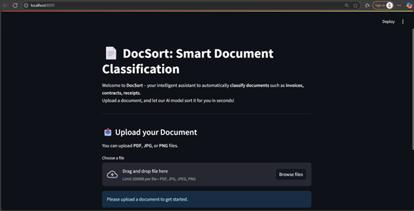
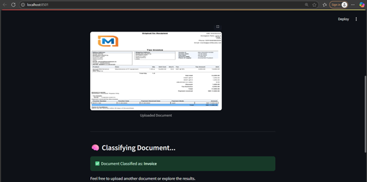

# 📄 DocSort

**DocSort** is a powerful document classification and extraction tool designed to help users effortlessly upload documents (PDF, JPG, PNG), automatically identify their type, and extract relevant text data. The intuitive interface makes it easy to upload files, view classification results with confidence scores, and export the extracted information.

---

## 🚀 Features

✨ Upload documents via drag-and-drop or file selection  
🔍 Automatic document type classification with confidence scores  
📝 Text extraction from uploaded documents  
📤 Export extracted data seamlessly  
🎨 Minimalistic UI with easy navigation

---

## 🛠️ Technologies Used

- Python  
- Tesseract OCR (for text extraction)  
- OpenAI - gpt-4.1-nano (for document text classification)  
- Streamlit (for frontend interface)  


---

## ⚙️ Prerequisites

- Python 3.10+  
- pip (Python package installer)

---

## 📝 Setup Instructions

### 1. Clone the repository

```bash
git clone &lt;your-repo-url&gt;
cd &lt;your-repo-directory&gt;


## Prerequisites

- Python 3.10
- pip (Python package installer)

---

## Setup Instructions

### 1. Clone the repository

### 2. Create virtual enviornment

```bash
python3 -m venv venv
source venv/bin/activate
```

### 3. Install Dependencies

```bash
pip install -r requirements.txt
```

### 4. Install Tesseract OCR

- Windows:

Download the installer from Tesseract OCR
Run the installer and follow instructions
Add Tesseract to your system PATH

- Linux:
```bash
sudo apt-get install tesseract-ocr
```

- MacOS
```bash
brew install tesseract
```

### 5. Run Streamlit app
```bash
streamlit run app.py
```

### 🖼️ Example Output
Below is an example of the uploaded document, classification result




### Usage
1. Launch the app with the command above.
2. Upload a document (PDF, JPG, PNG).
3. View the classification result with confidence score.
4. View the extracted text.
5. Export the data if needed.

